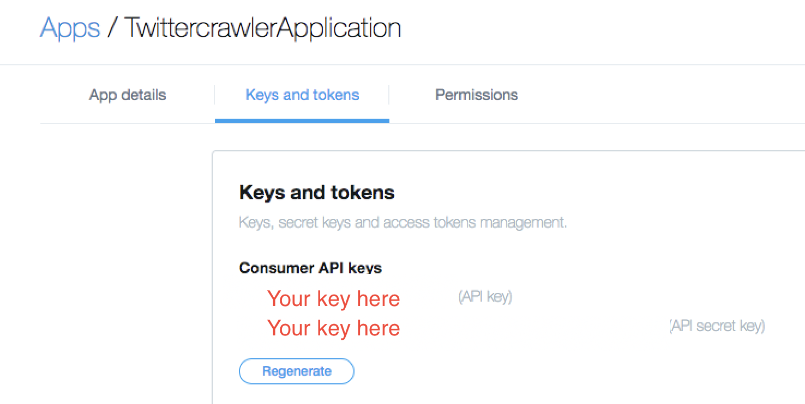

# Mini Analytics

A small scale analytics project. This project is composed of an API and a crawler.
The crawler periodically grabs tweets relating to the queries you create through the API. 


## Prerequisites
The requirements are as follows:
```
Docker
Maven
Twitter Keys
```
## Getting Started

### Twitter Secret App Keys
you need to apply for a [Twitter Developer Account](https://developer.twitter.com/)
 where you can then make an [app](https://developer.twitter.com/en/apps). 
 After this you can then generate **Consumer API keys** like so:
 
 
 These keys are then added to the ```application.properties``` file. 

### Maven
Install Maven from here [Maven](https://maven.apache.org//download.cgi).

Then in the project directory build the .jar files with a:
```
mvn clean install
```
### Docker
Then, if you haven't already, download [Docker](https://www.docker.com/get-started). 
 If you are on Mac/Windows, [Docker Compose](https://docs.docker.com/compose) is automatically installed. 
 On Linux, make sure you have the latest version of [Compose](https://docs.docker.com/compose/install). 
 If you're using [Docker for Windows](https://docs.docker.com/docker-for-windows/) on Windows 10 pro or later,
 you must 
 [switch to Linux containers](https://docs.docker.com/docker-for-windows/#switch-between-windows-and-linux-containers).

Then, in the project directory run:
```
docker-compose up
```
Then, head to:
``` 
localhost:8081
```
where you can use:

POST
* /queries (to make a new query)

GET
* /queries (to get all queries)
* /queries/_{queryId}_ (to get a specific query)
* /mentions (to get all mentions)
* /mentions/_{queryId}_ (to get all mentions for a query)

## Built With

* [Maven](https://maven.apache.org/) - Dependency Management
* [Docker](https://www.docker.com/) - Deployment 
* [Spring](https://spring.io/) - Java framework
* [MongoDB](https://www.mongodb.com/) - Database
* ([Kafka](https://kafka.apache.org/) & [Solr](http://lucene.apache.org/solr/), soon)
